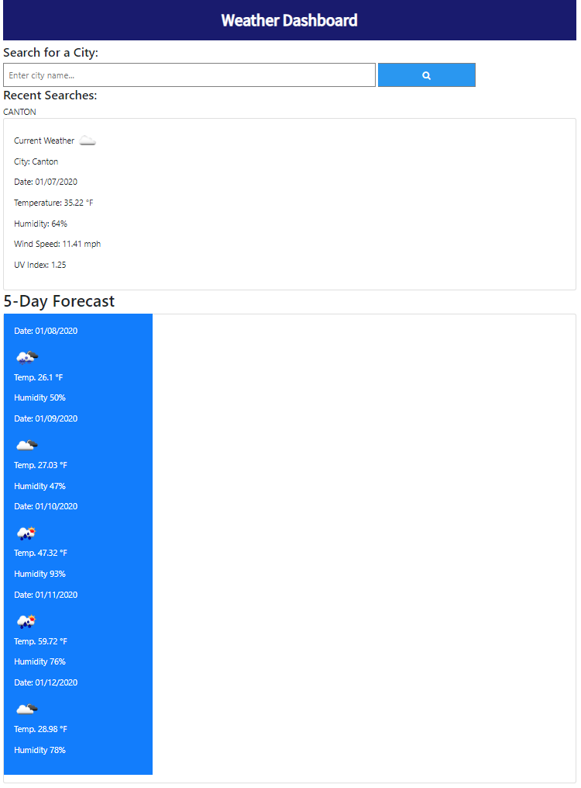

# Weather Dashboard  

## Purpose

To be able to check the weather for today and for 5 days ahead easily.

## Usage

 The page will load initially with a default city of Conshohocken, PA. Users can simply enter a city name in the input bar and click the blue search button to see current weather and 5-day forecast information for that city. Once users have searched for a different city, those will show up in the Recent Searches section of the page. When the user refreshes or returns to the page at a later time, the page will load and present weather data for the most recent search. 

 

 #### Live Site
 
 https://tdj03001.github.io/Weather-Dashboard/
 
 #### GitHub Repo
 
 https://github.com/tdj03001/Weather-Dashboard
 
